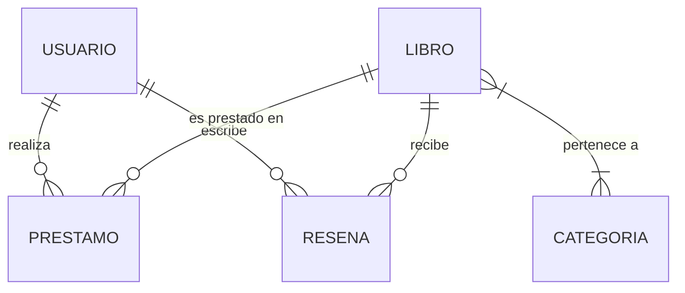
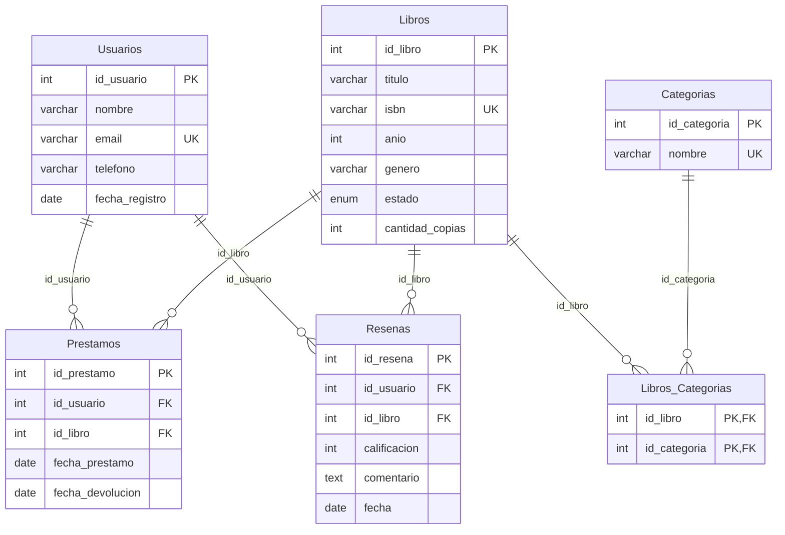

# Sistema de Biblioteca Digital - ReadFlow

Este repositorio contiene el diseño completo de la base de datos para la plataforma digital **ReadFlow**, encargada de gestionar libros, usuarios, préstamos y reseñas.

## Objetivo
Diseñar una base de datos normalizada hasta la Tercera Forma Normal (3FN) que garantice la integridad de los datos, prevenga la redundancia y cumpla con los requerimientos de la plataforma.

---

## 1. Modelo Conceptual

El modelo conceptual identifica las entidades principales y sus relaciones sin entrar en detalles técnicos de las tablas.

### Entidades Identificadas
* **Usuario**: Persona que se registra en la plataforma.
* **Libro**: Material de lectura disponible en el sistema.
* **Préstamo**: Acción de asignar un libro a un usuario por un tiempo determinado.
* **Reseña**: Calificación y opinión dada por un usuario a un libro.
* **Categoría**: Clasificación temática que puede tener un libro.

### Diagrama Entidad-Relación (E-R)
*(Puedes utilizar Draw.io o DrawSQL para generar una imagen a partir de este diseño. A continuación se presenta el modelo usando Mermaid)*

---

## 2. Modelo Lógico

En esta fase, transformamos las entidades en tablas (relaciones), asignamos tipos de datos preliminares y establecemos las llaves primarias (PK) y llaves foráneas (FK).

* **Usuarios** (<u>id_usuario</u>, nombre, email, telefono, fecha_registro)
* **Libros** (<u>id_libro</u>, titulo, isbn, anio, genero, estado, cantidad_copias)
* **Categorias** (<u>id_categoria</u>, nombre)
* **Libros_Categorias** (<u>id_libro</u>, <u>id_categoria</u>) -> *Tabla intermedia para resolver relación M:N*
* **Prestamos** (<u>id_prestamo</u>, id_usuario (FK), id_libro (FK), fecha_prestamo, fecha_devolucion)
* **Resenas** (<u>id_resena</u>, id_usuario (FK), id_libro (FK), calificacion, comentario, fecha)

### Diagrama Relacional

---

## 3. Normalización (hasta 3FN)

El diseño ha sido normalizado para asegurar la integridad de la información:

* **Primera Forma Normal (1FN)**:
  * Todos los atributos son atómicos (indivisibles).
  * No hay grupos repetidos. Por ejemplo, en lugar de tener un atributo `categorias` con una lista separada por comas en la tabla `Libros`, se creó la tabla `Categorias` y la tabla intermedia `Libros_Categorias`.
* **Segunda Forma Normal (2FN)**:
  * Cumple 1FN.
  * Todos los atributos no clave dependen funcionalmente y por completo de la clave primaria completa. En la tabla `Libros_Categorias` (donde la PK es compuesta), no hay atributos descriptivos que dependan de solo una parte de la clave.
* **Tercera Forma Normal (3FN)**:
  * Cumple 2FN.
  * No existen dependencias transitivas (ningún atributo no clave depende de otro atributo no clave). Por ejemplo, en `Prestamos`, las fechas dependen directamente del `id_prestamo` y no del usuario o libro de manera aislada.

---

## 4. Modelo Físico

El modelo físico corresponde a la creación real de la base de datos utilizando el lenguaje SQL (DDL). Las restricciones indicadas en el requerimiento han sido implementadas:
1. `ISBN único` implementado con la restricción `UNIQUE`.
2. `Email único` implementado con la restricción `UNIQUE`.
3. Validaciones de estado de los préstamos gestionadas a nivel lógico y con llaves foráneas.
4. Asociación obligatoria de préstamos y reseñas mediante restricciones `NOT NULL` en las llaves foráneas de `id_usuario` e `id_libro`.

### Archivos Incluidos en este Repositorio:
* `script_db.sql`: Contiene el script DDL con la creación de la base de datos, tablas y sus respectivas restricciones.
* `consultas.sql`: Contiene 3 consultas básicas para probar el modelo propuesto.

---

## Instrucciones para subir a GitHub
1. Inicializa un repositorio Git local en tu carpeta: `git init`
2. Agrega los archivos: `git add .`
3. Haz un commit: `git commit -m "Entrega diseño de base de datos ReadFlow"`
4. Ve a GitHub y crea un nuevo repositorio público llamado: **TuNombre_TuApellido_Biblioteca** (Reemplaza por tus datos reales).
5. Conecta tu repositorio local con el de GitHub siguiendo las instrucciones que te da GitHub (ej. `git remote add origin ...` y `git push -u origin main`).
